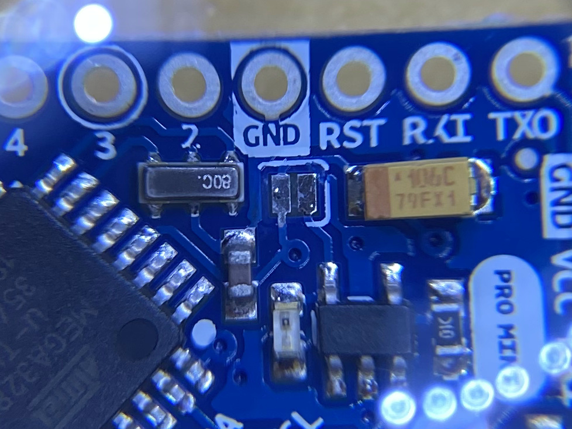

# mini-lora-examples
Some basic example code for the "Mini Lora Node" PCB - in the hope that it will be useful for others.

I've started with a simple "hello world" - the ttn-otaa example from arduino-lmic adapted for the Mini Lora, which you will find in "[mini-lora-hello_world](/mini-lora-hello_world)". I also did some [experiments with the TPL5110 chip](/tpl5110_blink).

My goal was to eventually provide a ready-to-use example where you can just add your custom sensors reading etc. This is what you can find in "[ttn-otaa-bme280-tpl5110](/ttn-otaa-bme280-tpl5110)". Make sure you read the notes below, see also the discussion here: [hallard/Mini-LoRa/issues/7](https://github.com/hallard/Mini-LoRa/issues/7)

I initially got interested in arduino-lmic and the Mini Lora PCB thanks to several posts by [AmedeeBulle](https://github.com/AmedeeBulle). I would like to thank him and [hallard](https://github.com/hallard) for making their work available to us!


## [ttn-otaa-bme280-tpl5110](/ttn-otaa-bme280-tpl5110)

### Additional Libraries

The "[ttn-otaa-bme280-tpl5110](/ttn-otaa-bme280-tpl5110)" sketch uses the following additional libraries:

* [arduino-lmic](https://github.com/matthijskooijman/arduino-lmic) (see also below / [my fork](https://github.com/crox-net/arduino-lmic))
* [rocketscream/Low-Power](https://github.com/rocketscream/Low-Power)
* [adafruit/Adafruit_BME280_Library](https://github.com/adafruit/Adafruit_BME280_Library)
* [ElectronicCats/CayenneLPP](https://github.com/ElectronicCats/CayenneLPP)


### arduino-lmic

My fork contains some changes by AmedeeBulle which reduce the sketch size, applied to the latest version by matthijskooijman as of April 2020.

If you use the original library, you will need to change this line in `lmic/config.h`:
```
static const SPISettings settings(8E6, MSBFIRST, SPI_MODE0);
```

### Issues encountered

Depending on which gateway I was using during the tests, I noticed that it was sometimes nearly impossible to join TTN. With the following addition to the sketch the issue went away completely, so I assume that it was caused by an inaccurate clock:
```
LMIC_setClockError (MAX_CLOCK_ERROR * 10 / 100);
```
I need to further investigate this eventually.


### Sensor

I use a BME280 break-out board from Adafruit, see [http://adafru.it/2652](http://adafru.it/2652), connected via I2C. You can easily add your own sensor by adding the required code to `setup()` and `read_sensor()`.


### CayenneLPP

I discovered the CayenneLPP format and found that the corresponding library provides a very straight-forward way to transmit sensor data with minimal overhead. This page gives you a good overview: [lora-cayenne-low-power-payload](https://developers.mydevices.com/cayenne/docs/lora/#lora-cayenne-low-power-payload).

It is also very straightforward to configure in the TTN console - just select "CayenneLPP" as payload format for your application, and it will be decoded automatically for you.


### R9 Value

You can check the TPL5110 datasheet to pick an appropriate value for R9 according to your needs. For tests I've replaced the resistor with a potentiometer (a trimpot actually), this is the reference of the component that I'm using: PVG5A204C03R00.


### Low-Power

My use case is i.a. off-grid sensors, so I was very interested in a low-power configuration. As suggestd by AmedeeBulle, I use a LiFePO4 battery, which means no power regulator is required, as the nominal voltage is 3.2V.

This means that it's actually very easy to achieve a low-power configuration with the Mini Lora and an [Arduino Pro Mini](https://www.sparkfun.com/products/11114) board from Sparkfun. The on-board regulator and the power LED can be disabled on the Arduino simply by removing a solder joint:

 

With this simple change, I measure less than 40 uA while in sleep mode. (The solder joint might not be available on "clone" boards - in that case you might need to unsolder the regulator and the LED, or cut the corresponding traces to achieve the same results.)

hallard mentions some further changes that allow the board to operate with lower voltages than standard (basically extending the time the board will run when the battery voltage lowers over time). This requires reflashing the bootloader / changing fuses, and I haven't tried it yet, but I definitely plan to.


### Results

I feed the data from the sensor in an InfluxDB instance and display it with Grafana:


